# Ujian Akhir Semester: Deploy 2 System Apps Static Web dan Dynamic Web

1. Membuat Instance baru pada AWS Region Ap-southeast-1 Singapore
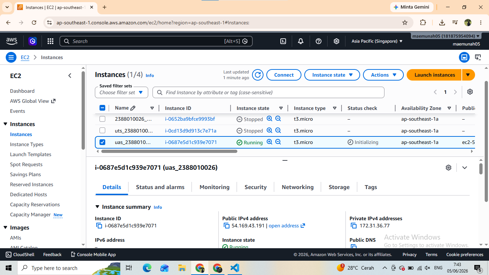

2. Membuat Folder Project UAS
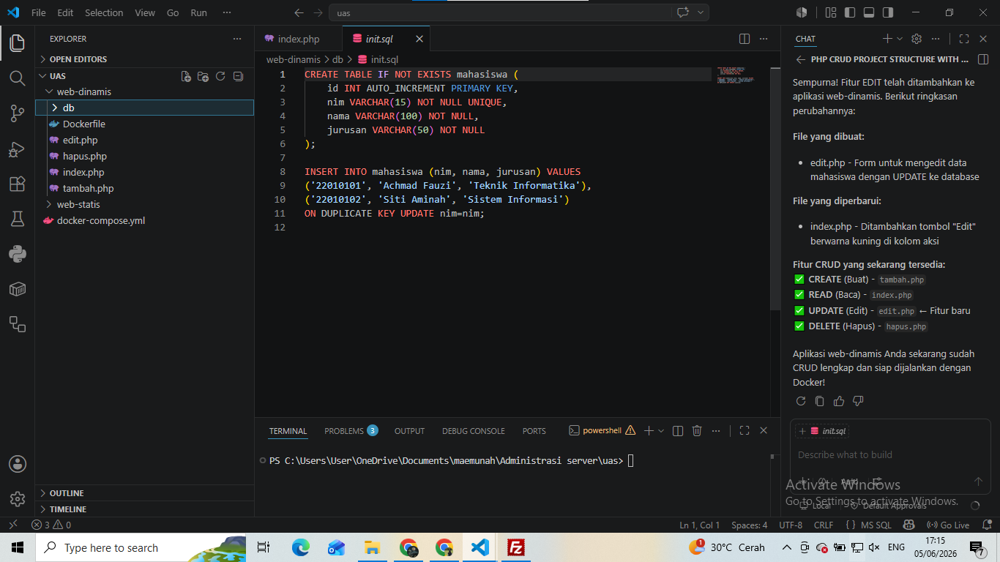

3. Masukkan web statis UTS ke dalam folder Project UAS-CLOUD/static-cv
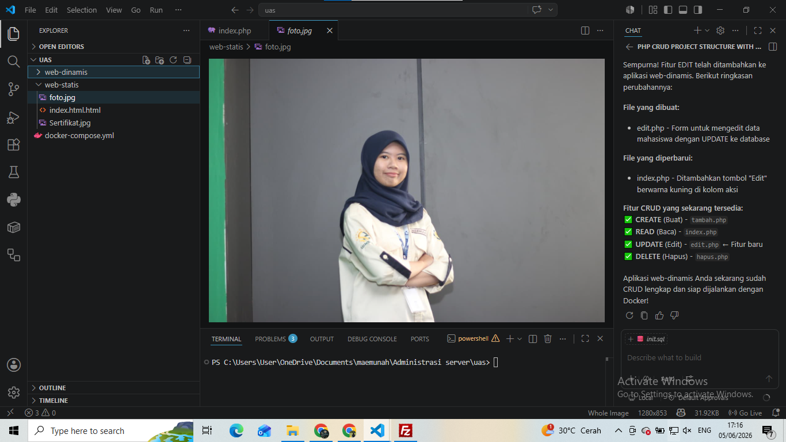

4. Membuat website dinamis menggunakan PHP
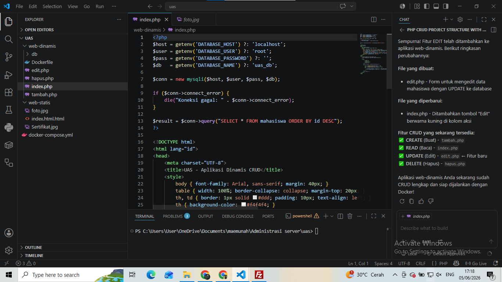

5. Install Docker dari repository resmi Docker (jalankan dipowerShell)
"sudo apt update"
"sudo apt install -y ca-certificates curl gnupg"
"sudo install -m 0755 -d /etc/apt/keyrings"
"curl -fsSL https://download.docker.com/linux/ubuntu/gpg | sudo gpg --dearmor -o /etc/apt/keyrings/docker.gpg"
"sudo chmod a+r /etc/apt/keyrings/docker.gpg"
". /etc/os-release"
"echo "deb [arch=$(dpkg --print-architecture) signed-by=/etc/apt/keyrings/docker.gpg] https://download docker.com/linux/ubuntu ${VERSION_CODENAME} stable" | sudo tee /etc/apt/sources.list.d/docker.list > /dev/ null"
"sudo apt update"
"sudo apt install -y docker-ce docker-ce-cli containerd.io docker-buildx-plugin docker-compose-plugin"

LALU AKTIFKAN DOCKER
"sudo systemctl enable docker"
"sudo systemctl start docker"
"sudo usermod -aG docker ubuntu"

LALU CEK APAKAH DOCKER BERHASIL DIINSTALL
"docker --version"
"docker compose version"
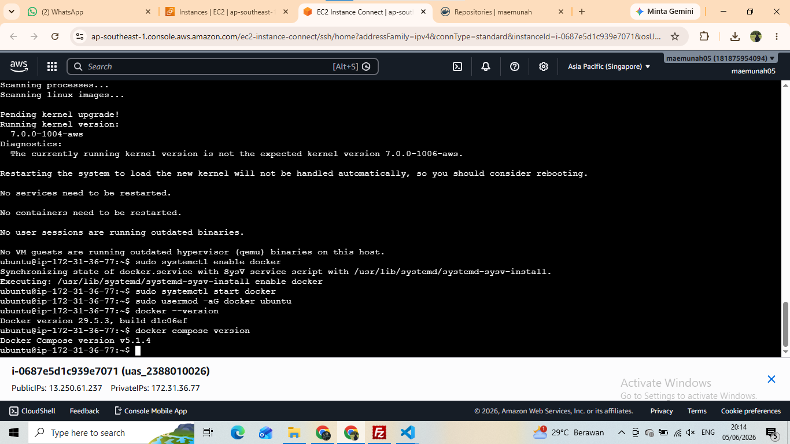

6. Set Up Docker Hub
BUAT REPOSITORY BARU PADA DOCKER HUB
"maemunah/uas-statis"
"maemunah/uas-dinamis"
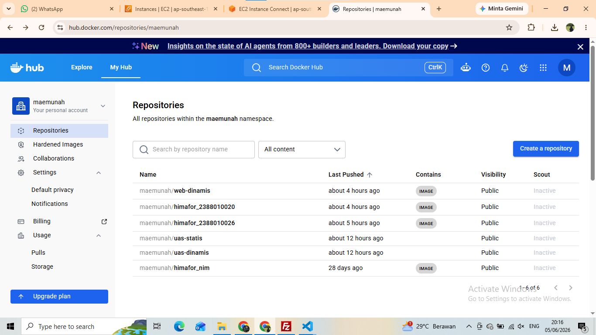
BUAT ACCESS TOKEN DOCKER HUB "Account Settings -> Personal access tokens -> Generate new token" "Permission : Read & Write"
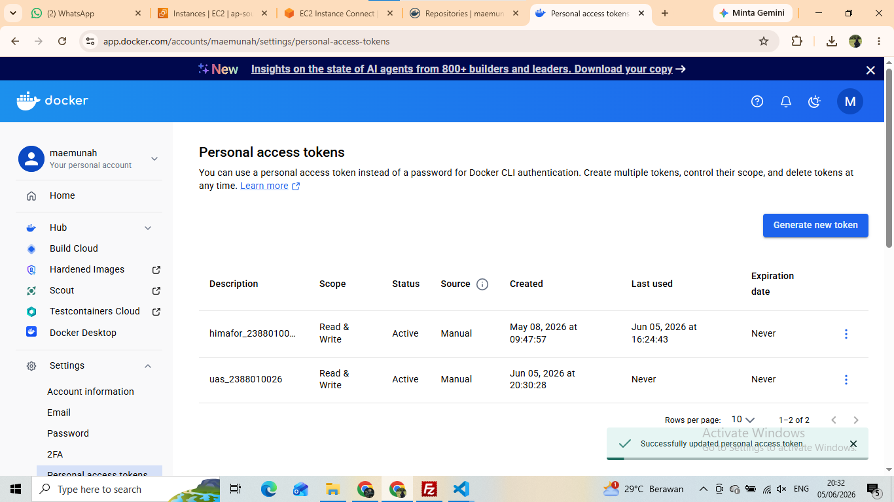

7. Login Docker ke EC2 melalui PowerShell
"docker login -u maemunah" (Saat diminta password, paste Docker Hub access token, bukan password akun biasa.)
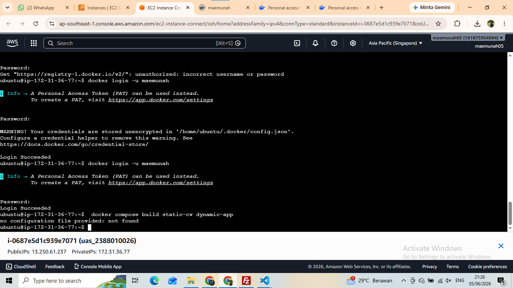
BUILD IMAGE DARI PROJECT Pastikan Posisi Folder di (cd ~/uas-cloud) lalu build "docker compose build static-cv dynamic-app" lalu push i mage ke docker hub "docker compose push static-cv dynamic-app"

8. Set Up Github Repository
BUAT REPOSITORY BARU "https://github.com/maemunah15/uas_2388010026"
LALU CONNECT FOLDER PROJECT KE REPOSITORY BARU "git remote add origin https://github.com/maemunah15/uas_2388010026"
LALU PUSH FOLDER PROJECT KE REPOSITORY "git add ." "git commit -m "Initial UAS cloud deployment project"" "git push -u origin main"
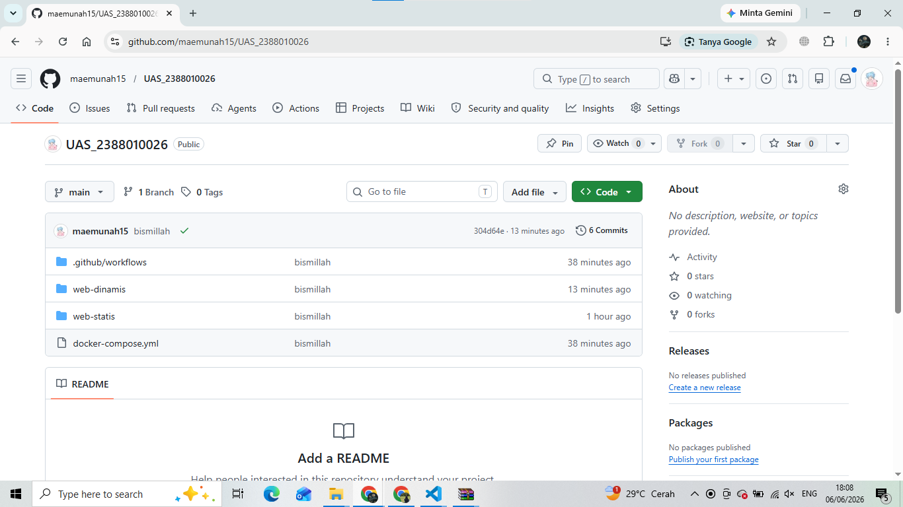

9. Set Up Github Secret
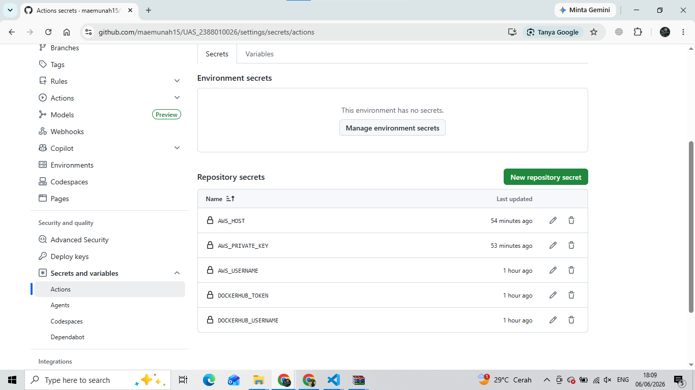

10. Set Up Github Action
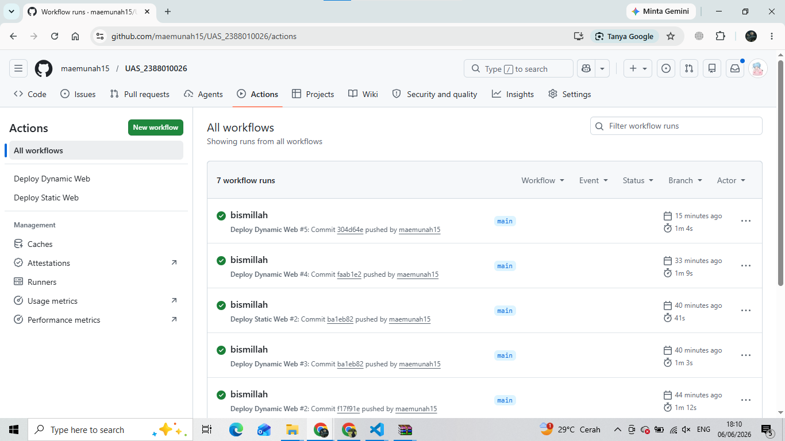

11. Tes Menjalankan Web Statis & Dynamic
- Statis
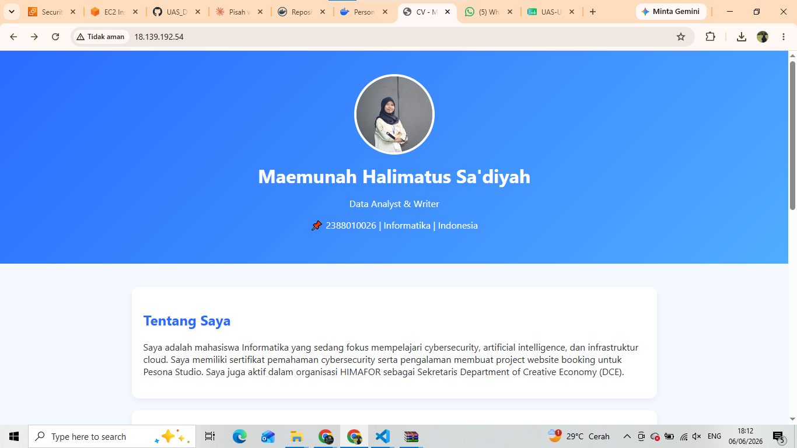

- dinamis
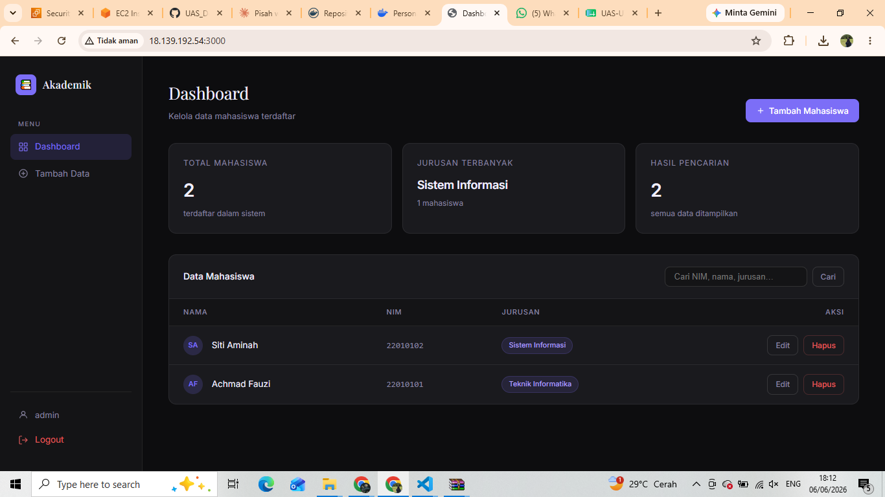
