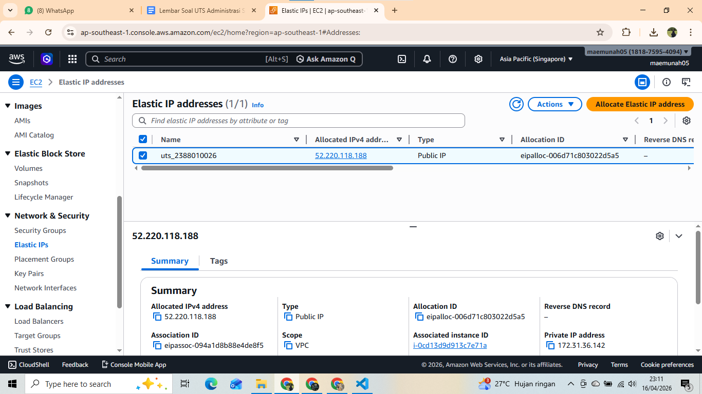
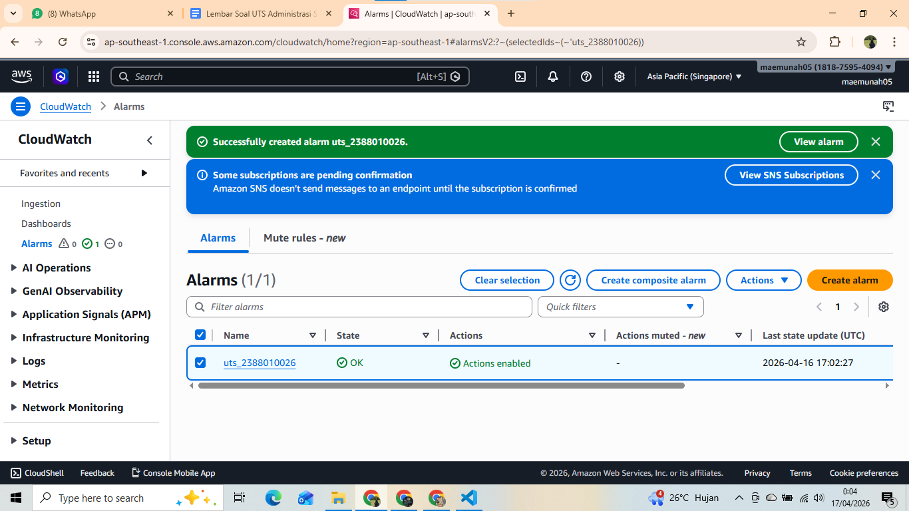
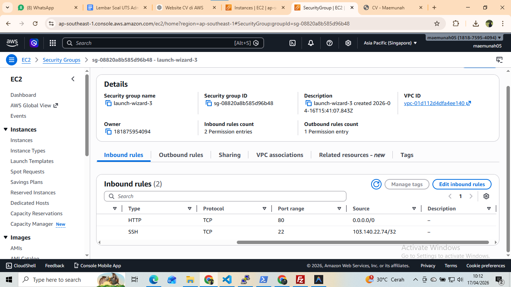
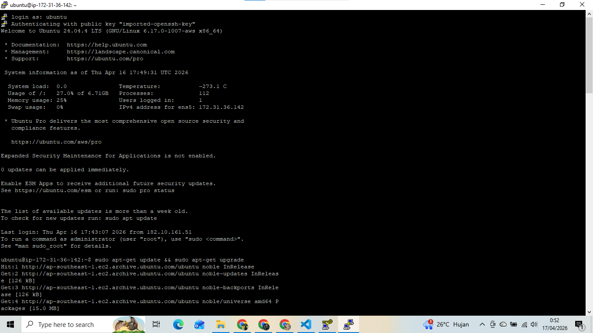
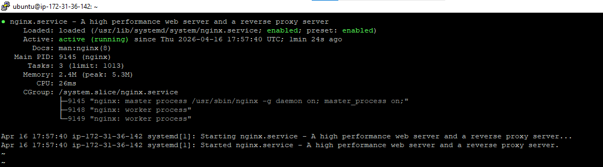
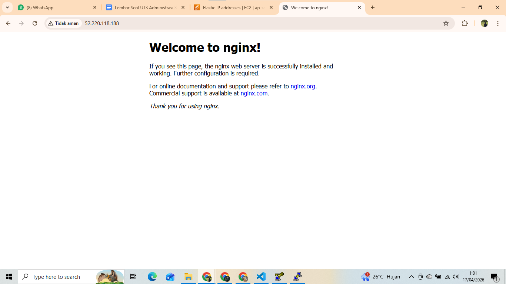
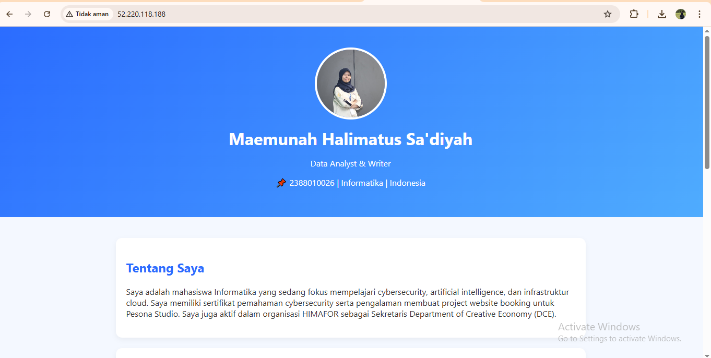

# Laporan UTS Administrasi Server

Maemunah Halimatus Sa'diyah | 2388010026 | Informatika 6A

1. Tahap Provisioning & Security
- Membuat instance EC2 di region Singapore (ap-southeast-1) dengan nama uts_2388010026, tipe t2.micro/t3.micro, dan OS Ubuntu 22.04/24.04.
- Mengatur Key Pair, storage 8 GB, serta Security Group (SSH: My IP, HTTP: 0.0.0.0/0).
- Menjalankan instance hingga running, lalu membuat dan menghubungkan Elastic IP agar IP tetap.

2. Wajib mengaktifkan Detailed CloudWatch Monitoring dan membuat 1 buah Alarm jika penggunaan CPU menyentuh >80%.

3. Security Group Inbound Rules (menunjukkan Port 22 hanya diakses oleh My IP).

4. Mengaktifkan dan menjalankan nginx

5. Deployment Aplikasi Web
- Setelah layanan Nginx berhasil dijalankan, dilakukan pengujian dengan mengakses alamat IP publik (Elastic IP) melalui browser.
- Website CV yang telah diunggah kemudian berhasil ditampilkan, menandakan bahwa proses deployment berjalan dengan baik dan server dapat diakses secara online.
- Dengan demikian, konfigurasi web server dan proses upload file website telah berhasil dilakukan tanpa kendala.
