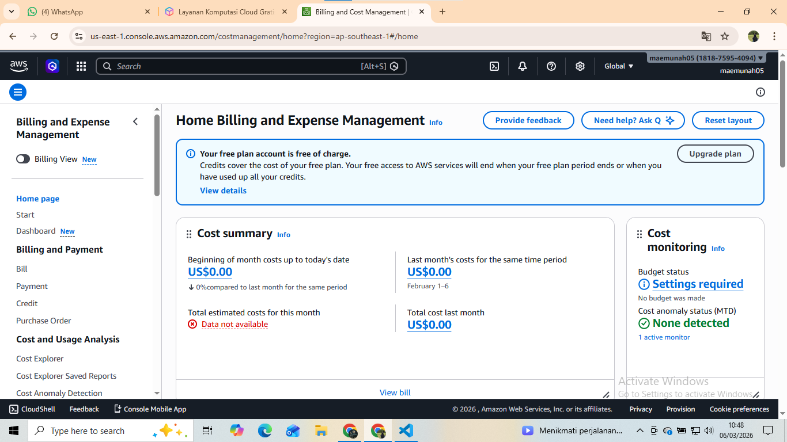
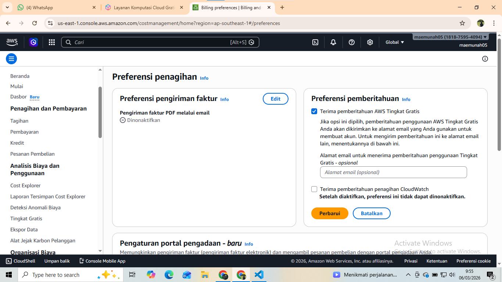
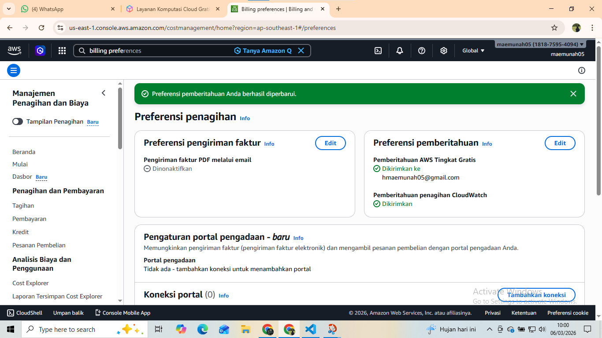
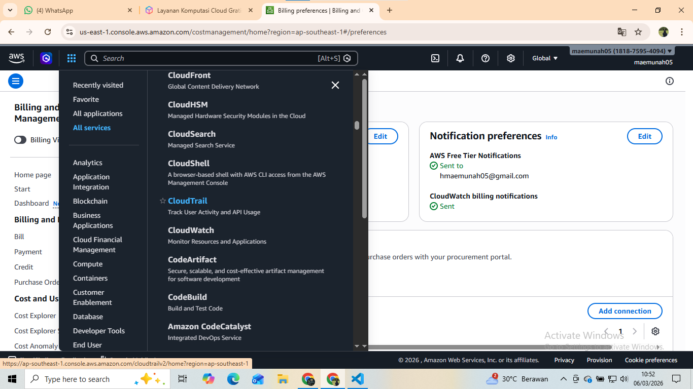
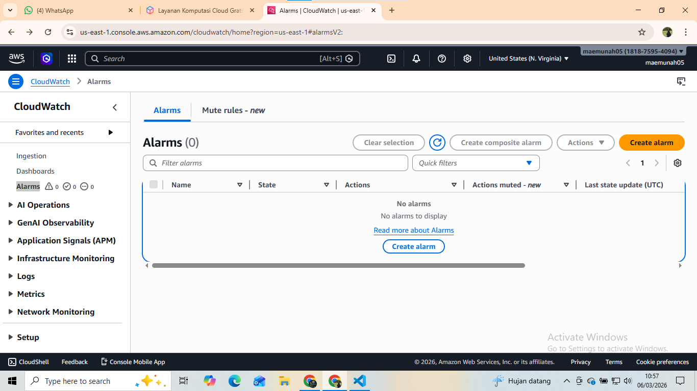
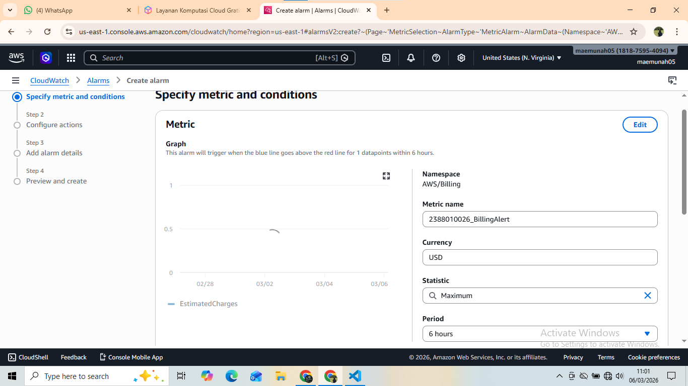
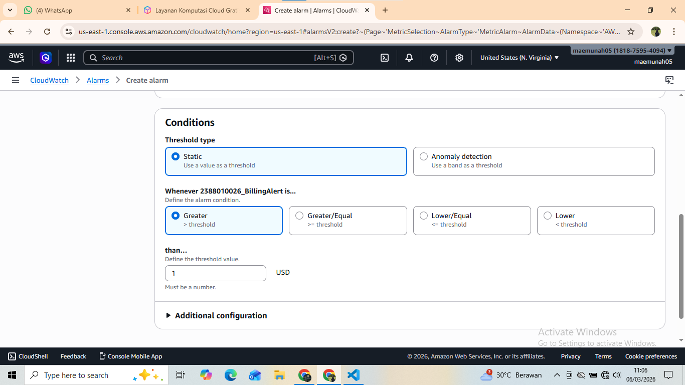
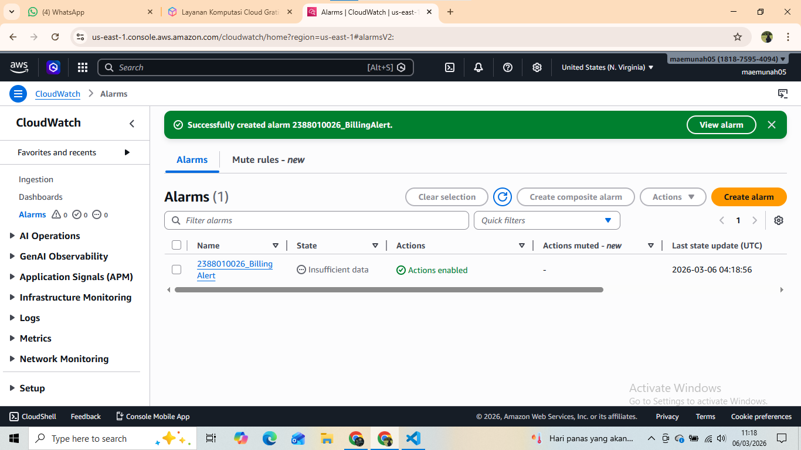

# Membuat Billling Alert di AWS untuk menghindari kelebihan alokasi dana 

1. Menu Dashboard AWS kita pilih Billing Preference untuk mengaktifkan Alert
-Masuk Menu Billing and Cost Manajemen

-Pada Menu Cost Manajemen Scroll Ke bawah pilih Billing Preferences
-Pilih Menu Alert Preferences klik Edit

-Isi Email ceklis Receive
-Klik Update 

2. Masuk Menu Cloudwatch
-Pilih All Service lalu cari Cloudwatch

3. Pilih Menu Create Alarm
-Pastikan Region ada di US N Virginia

-Klik Menu  Create Alert
-Klik Metric
-Klik Menu Billing
-Pilih Menu Total Estimated Charge
-Pilih / Ceklis Mata Uang USD
-Klik Select Metric
-beri nama Alert = NIM_Billing Alert

-Conditions  Static->Greathertha-> 1 USD

-Create new Topic = > NIM_BillingAlert -? KLik Create
-Select an existing SNS topic - > NIM_BillingAlert
-Klik Next
-Alarm Name -> NIM_BillingAlert 
-Create Alarm
-Buka 
