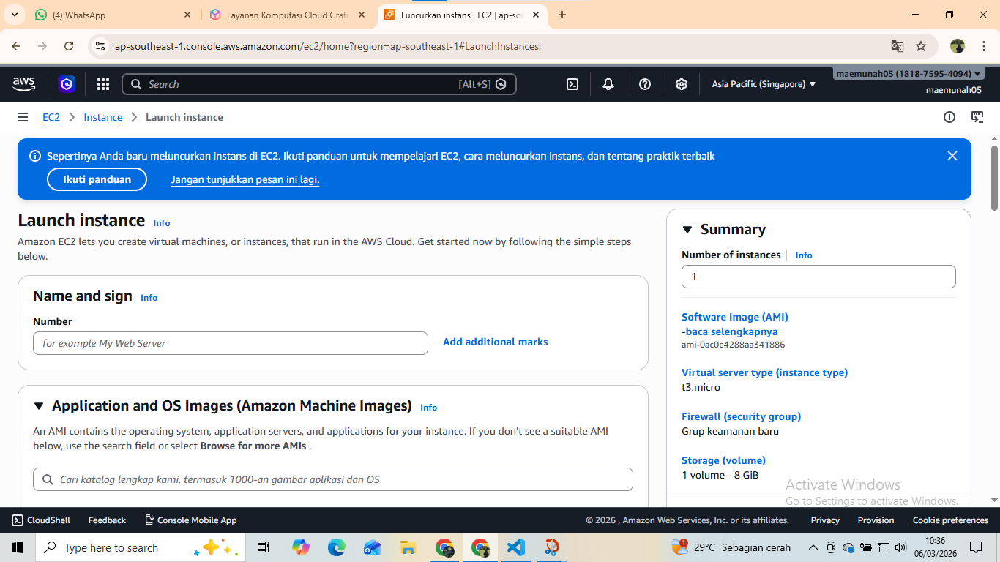
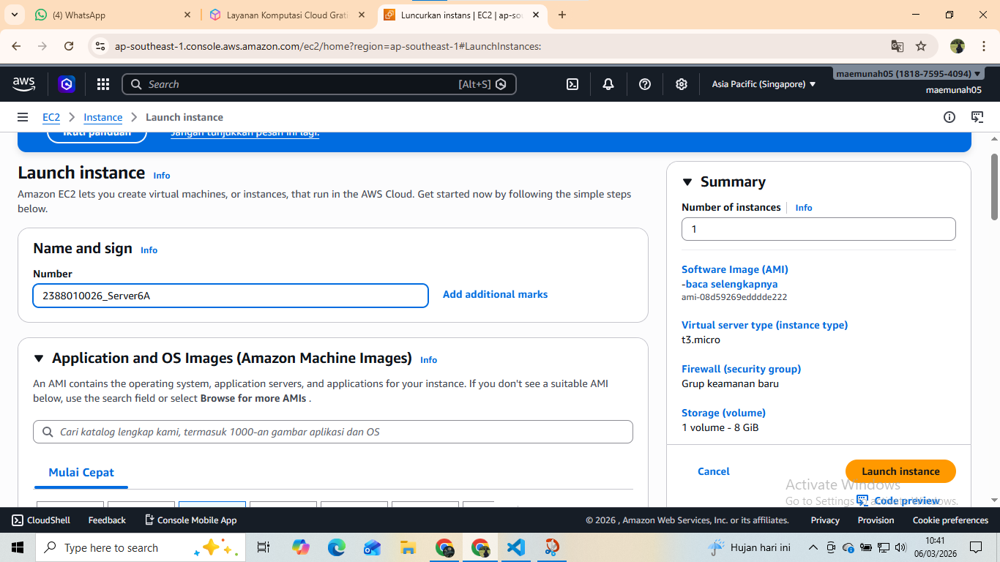
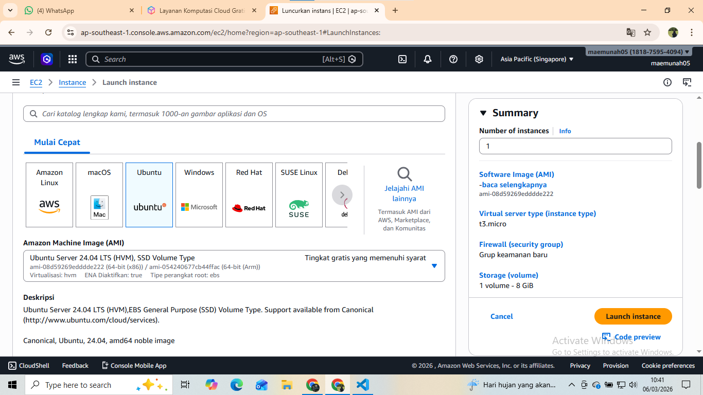
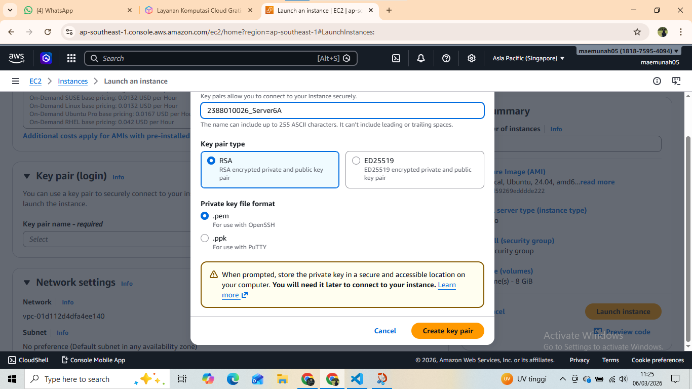
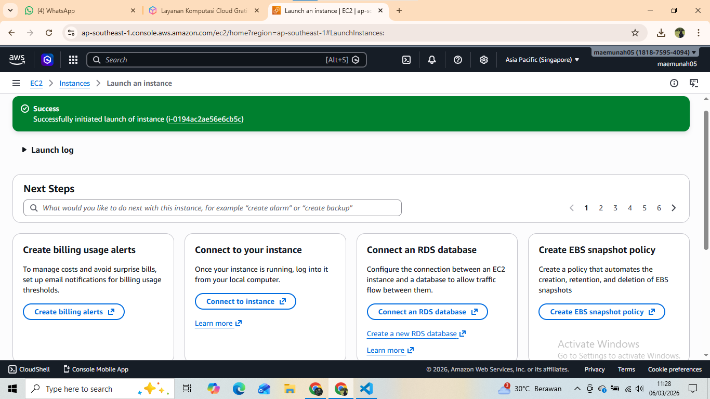
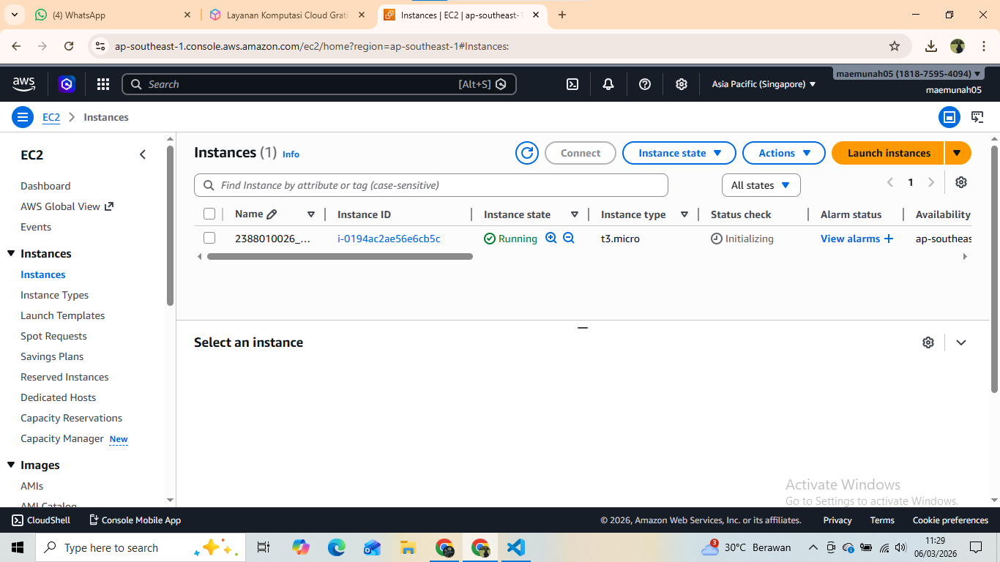
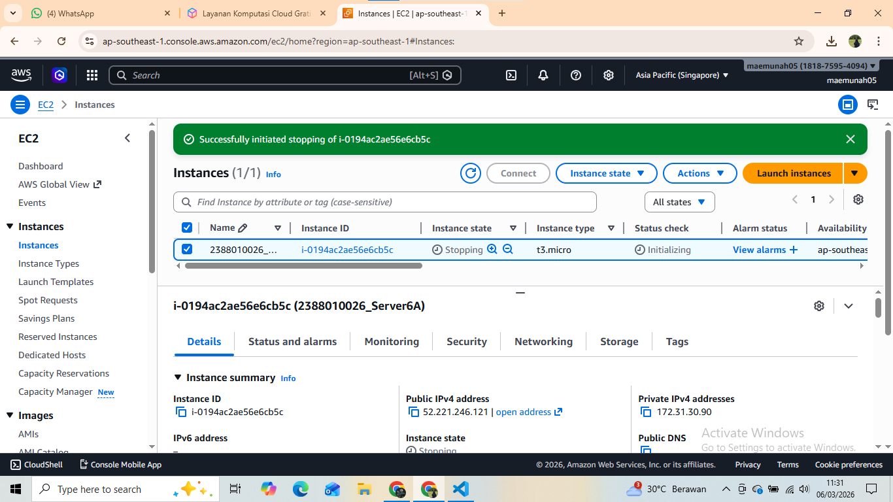

# Membuat VM / Instance di AWS EC2 dengan AMI

1. Buka EC2 dari Dasboard
2. Klik Menu Launch Instance

3. Pastikan Region memilih terdekat
4. Isi Nama Instance -> NIM_Server6A

5. OS pilih Linux Ubuntu

6. Instance Type pilih T3.Micro

7. Membuta Key Pair -> Create new Key Pair -> Isi Nama -> File.Pem -> Create

8. Network Security
-Allow SSH Traffic
-Allow HTTPS
-Allow HTTP

9. Storage  setting -> 30Gb
10. Klik Launch  Instance
11. Pastikan Alert Succes

12. Pastikan nama sesuai -> Klik Instance

13. Lalu matikan
