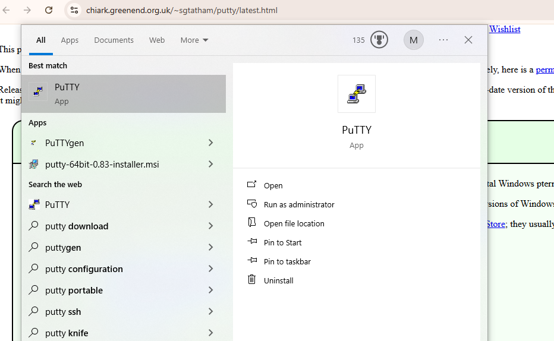
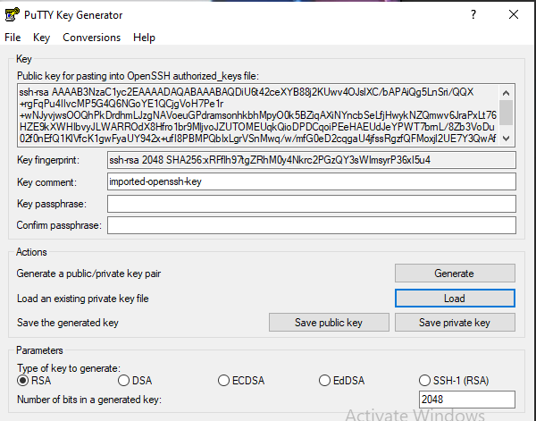
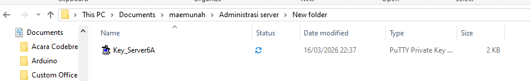
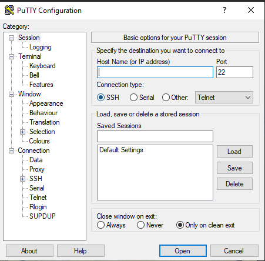
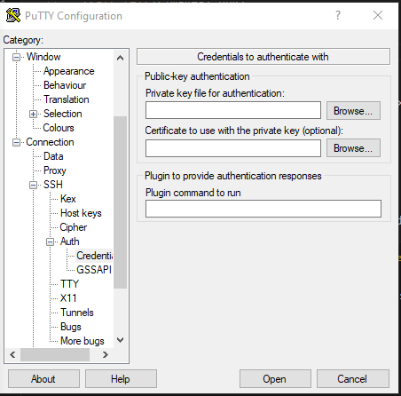
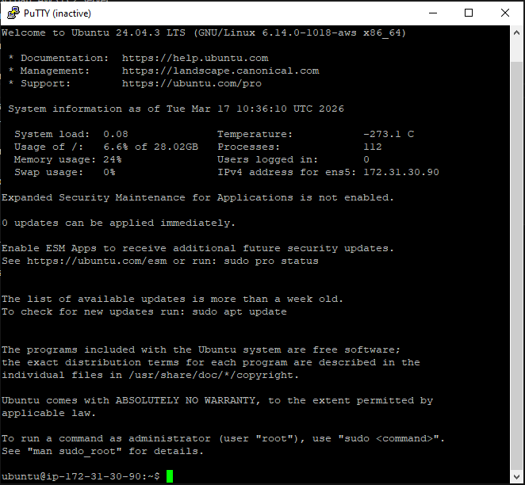
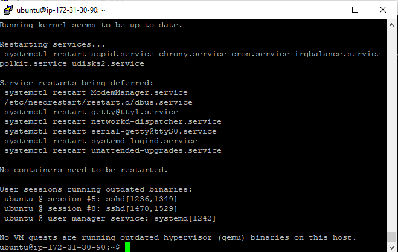
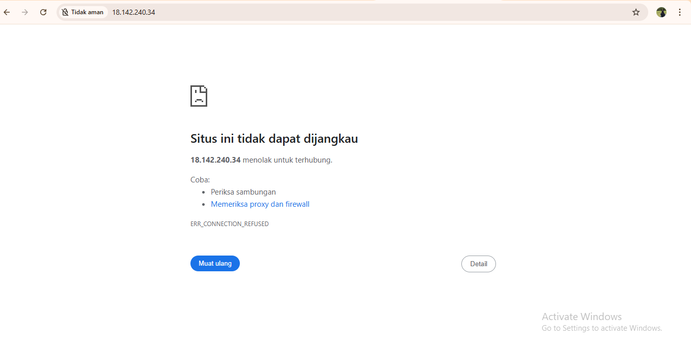
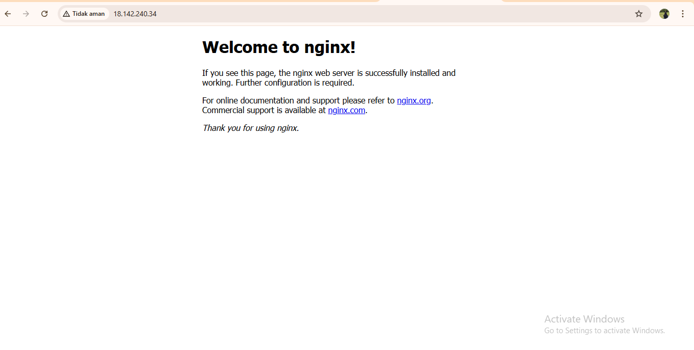

# Remote SSH dari  AWS EC2 Server 

1. Unduh dan Install Putty di https://www.chiark.greenend.org.uk/~sgtatham/putty/latest.html

2. Konversi ekstensi Private key dari .pem menjadi .ppk
-Buka Putty Gen
-Load Private Key .pem (file .pem didapat saat membuat instance EC2 yang ada di folder pertemuan 2 yang biasanya di folder download)

-Klik Save Private Key menjadi ekstensi File .ppk

4. Setting-Up Remote SSH dengan PPitty
-Isi Ip4 addres Public

-Port SSH (22)
-Load private key di .ppk di menu COnnection -> SSH ->Auth -> Credential

-User dari instance  masing-masing (ubuntu)

6. Setiap awal Remote kita lakukan Patching OS
-sudo apt-get update && sudo apt-get upgrade

7. Coba lakukan instalasi web server dalam keadaan kosong

Instal salah satu web server
- sudo apt install nginx

