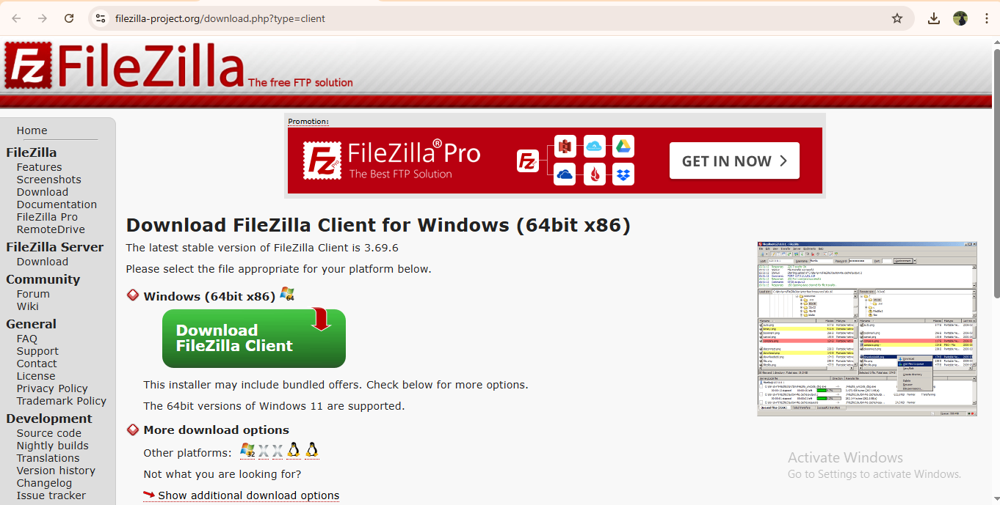
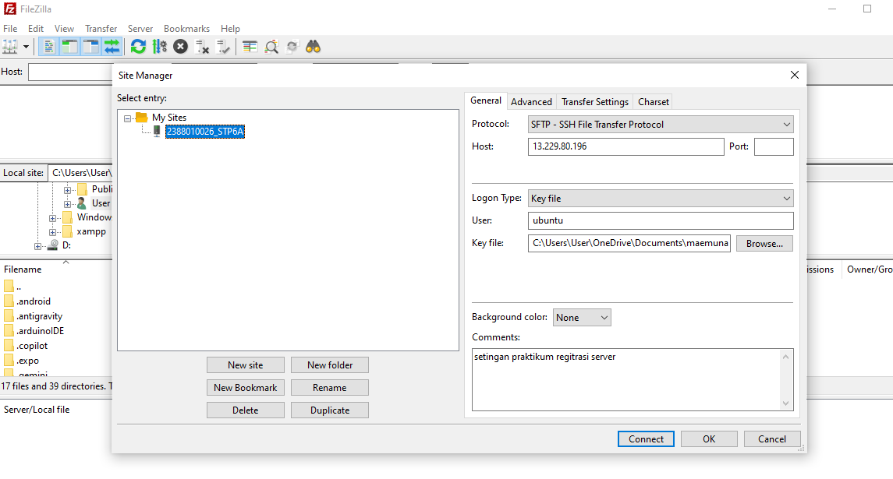
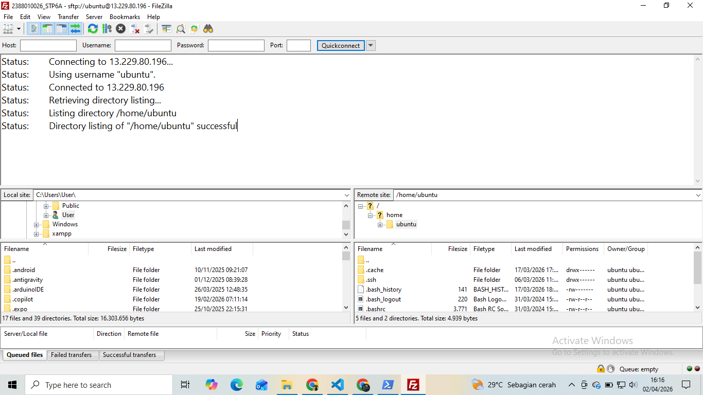
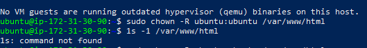
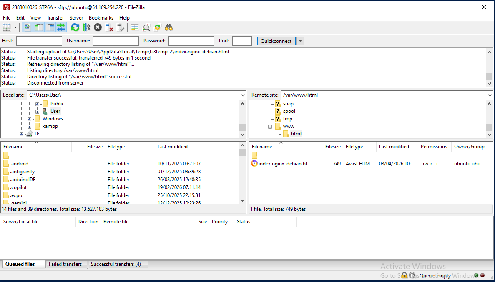
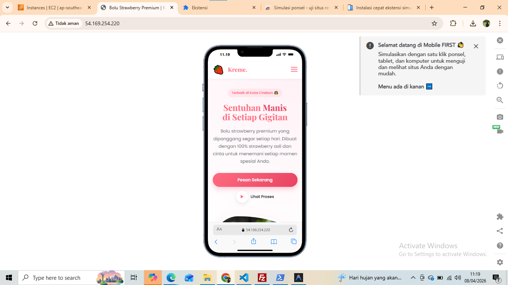

# Migrasi Data Lokal ke cloud SFTP dan Manajemen Hak Akses Web

1. Unduh dan Install Filezilla di https://filezilla-project.org/download.php?type=client

2. Running Instance EC2 di AWS (instance -> start Install)

3. Buka FileZilla dan masukkan data berikut:
    - Host: [IP_ADDRESS]
    - Username: ubuntu
    - Password: [PASSWORD]
    - Port: 22
    - Klik Connect
    
    

4. Remote SSH via PowerShell Windows
    - masuk folder penyimpanan private key
    - open with -> powershell
    - masukan command (ssh -i nama file-Private-Key.pem ubuntu @[IP_ADDRES])
    
5. Directori Folder Cloud arahkan ke folder Web Services Area
    - Keluar dari directori /var/www/html
    - Buka file index.html dengan code editor
    - Akan melakukan gagal eiditing - Permission denied
    - Karena kita masuk user ubuntu tidak punya akses untuk write 

6. Ubah Hak Akses Folder Web Services Area
    - ke terminal PowerShell
    - masukkan command (sudo chown -R ubuntu:ubuntu /var/www/html)
    - cek kembali hak akes folder dengan command (1s -1 /var/www/html)

7. Kita lakukan editing di file index.html setelah 
8. Pastikan Design Responsive

