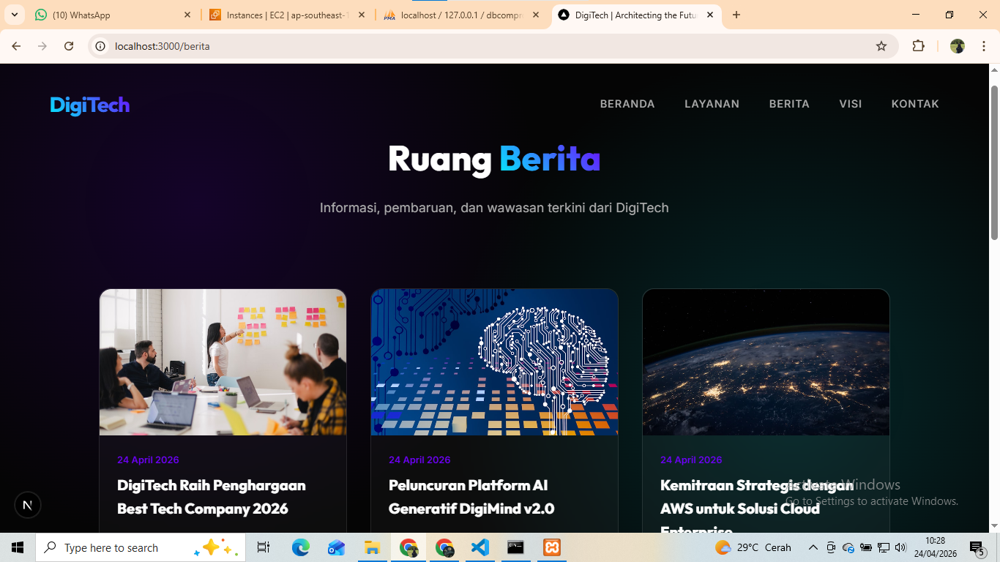
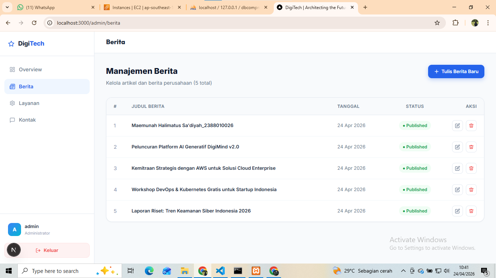
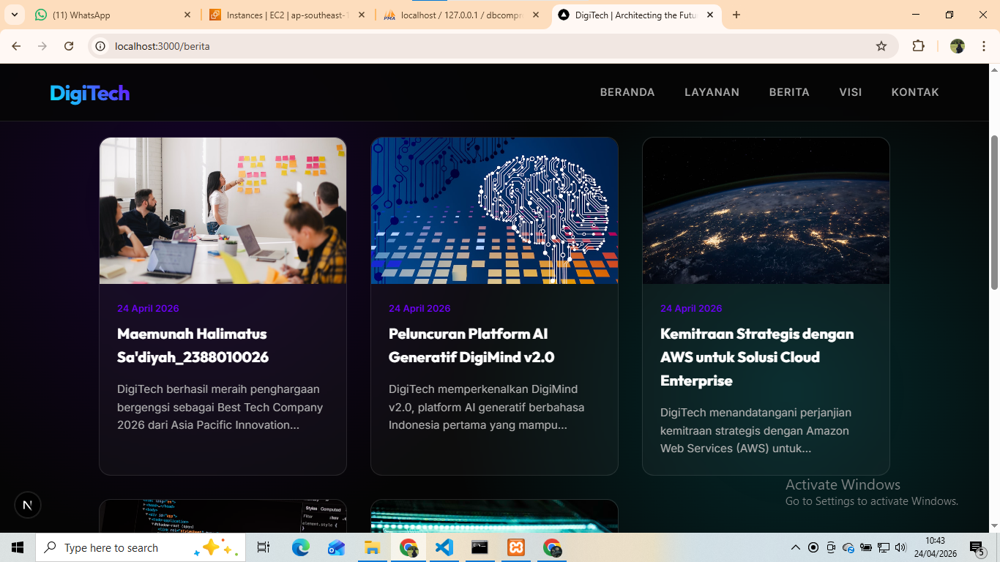

# Deploy Web Apps Framework Next.js ke Aws

1. Pastikan Web Apps berjalan di local
- install dependensi 'npm install'
- create db dan import sql
- create file .env dan isi sesuaikan dengan db local
- jalankan web apps di browser 'https://localhost:3000'
- testing front pastikan tampilan muncul da tanpa error
- testing back end 'https://localhost:3000/admin'
    username: admin
    password: admin123
 

-Create static file -> npm run build
- Archive folder standalone -> zip -> klik kanan folder standalone -> send to -> coompressed (zipped) folder

2. Proses Deploy File ke AWS
- Nyalakan instance AWS
- Connect Open SSH
- Connect Filezille  